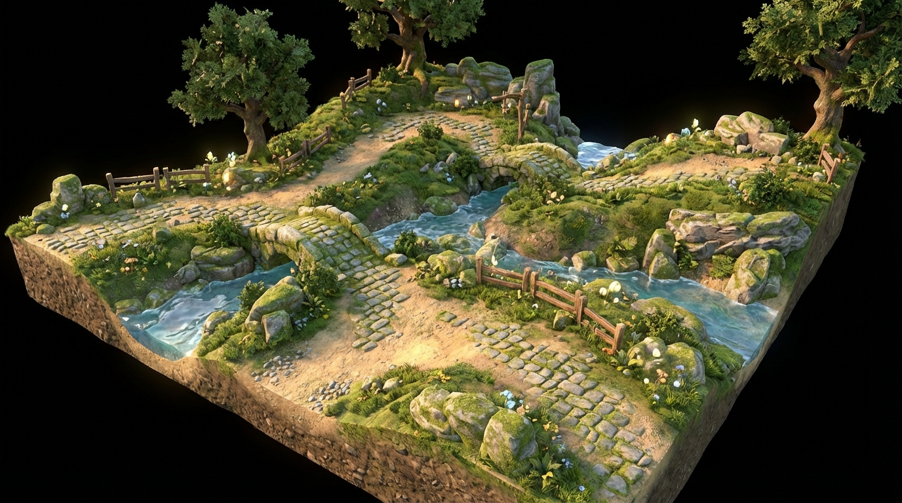

<p align="center">
  
</p>

<h1 align="center">SPLATTER</h1>

<p align="center">
  
  <a href="https://poqpoq.com/world/"></a>
  
  
</p>

<p align="center">
  Paint the world. Watch it breathe. Trails wear. Moss creeps. Rivers carve. Fire scorches.
  <br>
  The terrain texture authority for <a href="https://poqpoq.com/world/">poqpoq World</a>.
</p>

<p align="center">
  <a href="https://poqpoq.com/terraformer/">Terraformer</a> ·
  <a href="https://poqpoq.com/dungeon-master/">Dungeon Master</a> ·
  <a href="https://poqpoq.com/animator/">Animator</a> ·
  <a href="https://poqpoq.com/skinner/">Skinner</a> ·
  <a href="https://poqpoq.com/landscaper/">Landscaper</a> ·
  <a href="https://poqpoq.com/world/">World</a>
</p>

---

## The Vision

Most game engines paint terrain once. An artist opens a brush tool, stamps grass here, rock there, saves, ships. The ground is dead — a photograph of a moment that never existed.

Splatter takes a different approach. Terrain in poqpoq World is **alive**. Paths wear down under foot traffic. Moss creeps into the cracks of old cobblestones. Torch fire scorches the dungeon floor. Rain softens hard earth to mud. An AI companion plants a moon seed, and over fifty metres the soil darkens, crystallizes, glows.

None of this is hand-painted. None of it is random. It's **systemic** — a seven-layer compositor where each layer has a clear owner, a clear purpose, and a clear relationship to the world simulation running beneath it.

Splatter is the painting tool, the compositor architecture, and the creative interface that ties it all together.

---

## The Seven-Layer Stack

Every texel on the ground is the result of seven layers evaluated in order. Some are baked at world creation. Others change every frame.

| Layer | Name | What It Does | When It Changes |
|:-----:|------|-------------|-----------------|
| **1** | Height / Slope Mask | Steep slopes get rock. Flat land gets grass. Physics. | World generation only |
| **2** | Base Noise | Natural variation — no two patches of dirt look the same | World generation only |
| **3** | Biome Overlay | Seasons shift. Deserts creep. Snow lines rise and fall. | Slow drift on game-time |
| **4** | Path Network | Trails, roads, rivers carved into the landscape | When paths are edited |
| **5** | Object Influence | Torches scorch. Water seeps. Trees shade. Moon seeds glow. | When objects move or change |
| **6** | Maker Paint | Your brush. Your rules. Direct creative control. | When you paint |
| **7** | Transient FX | Footprints. Spell burns. Rain puddles. Gone in minutes. | Every frame, with decay |

Layers 1-2 come from **Terraformer** (the heightmap editor). Layers 3-5 and 7 are evaluated at runtime by **World** (the game engine). Layer 6 is **Splatter's** domain — the maker's creative canvas.

---

## What Splatter Does

Splatter is a standalone micro-app launched as a sandboxed iframe from three different hosts — Terraformer (during world design), World (during live play), and Dungeon Master (for indoor surfaces). It communicates with its host via a `postMessage` API and has no engine dependencies.

### Three Tiers of Creative Access

| Tier | For | Tools |
|:----:|-----|-------|
| **1** | All makers | Brush, erase, smear, opacity — direct painting |
| **2** | Experienced builders | Rule composer — `slope > 45° → rock`, `height < 5m → sand` |
| **3** | World owners & admins | Physics painter — author object influence halos, review AI proposals |

### Key Components

- **Layer Compositor UI** — visual stack of all seven layers with blend controls
- **PathStyleEditor** — per-path material assignment, edge moss, wear simulation, intersection rules
- **AI Proposals Panel** — review, approve, or reject terrain changes proposed by AI companions
- **Preset Library** — shareable texture rulesets published to the maker community
- **TextureCatalog** — shared browsable palette of PBR materials used across all BlackBox tools

---

## Architecture

```
                    ┌─────────────────────────────────────┐
                    │           HOST APPLICATION           │
                    │   (Terraformer / World / DungeonMaster)  │
                    └──────────┬──────────────────────────┘
                               │ postMessage API
                    ┌──────────▼──────────────────────────┐
                    │            SPLATTER                  │
                    │  ┌────────────────────────────────┐  │
                    │  │     Layer Compositor UI        │  │
                    │  │  ┌─────┐ ┌─────┐ ┌─────────┐  │  │
                    │  │  │Tier1│ │Tier2│ │  Tier3  │  │  │
                    │  │  │Brush│ │Rules│ │ Physics │  │  │
                    │  │  └─────┘ └─────┘ └─────────┘  │  │
                    │  ├────────────────────────────────┤  │
                    │  │      PathStyleEditor           │  │
                    │  ├────────────────────────────────┤  │
                    │  │    AI Proposals  │  Presets     │  │
                    │  └────────────────────────────────┘  │
                    │                                      │
                    │  TextureCatalog (shared module)       │
                    └──────────────────────────────────────┘
```

### Cross-Team Coordination

Splatter sits at the intersection of four teams. See [comms/Comms.md](comms/Comms.md) for the running coordination thread and [docs/](docs/) for each team's planning documents.

| Team | Repo | Relationship to Splatter |
|------|------|-------------------------|
| **Terraformer** | [BlackBoxTerrains](https://github.com/increasinglyHuman/BlackBoxTerrains) | Provides baked Layers 1-2, spline metadata, path distance fields |
| **World** | [poqpoq-world](https://github.com/increasinglyHuman/poqpoq-world) | Hosts Splatter iframe, runs runtime compositor, consumes Layer 6 data |
| **DungeonMaster** | [BlackBoxDungeonMaster](https://github.com/increasinglyHuman/BlackBoxDungeonMaster) | Consumes TextureCatalog for dungeon surface materials |

---

## Project Status

Splatter is in **design phase**. The four-team ADR process is active. No implementation has begun.

### Current Progress

- [x] ADR-001 — Terrain Texture Authority & Module Topology (Accepted)
- [x] Cross-team planning documents exchanged (all four teams)
- [x] Layer ownership and module boundaries agreed
- [ ] ADR-002 — Path System / SDF Contract (Terraformer drafting)
- [ ] ADR-003 — postMessage API & Module Boundaries (Splatter drafting)
- [ ] ADR-004 — Maker Three-Tier Access Model (Splatter + World)
- [ ] ADR-005 — Dirty-Flag Evaluation & Spatial Tracking (World)
- [ ] ADR-006 — Event Log Schema & AI Terrain API (World)
- [ ] Shared texture format agreement (all teams)
- [ ] Phase 1 implementation begins

---

## Documentation

| Document | Description |
|----------|-------------|
| [ADR-001 — Terrain Texture Authority](docs/ADR-001-Terrain-Texture-Authority.md) | The foundational architecture decision record |
| [ADR-001 — Remaining Work](docs/ADR-001-remaining-work-summary.md) | Open questions and follow-on ADRs needed |
| [Cross-Team Coordination](docs/CROSS-TEAM-COORDINATION.md) | Terraformer team's coordination plan |
| [World Team Division of Labor](docs/ADR-001-Cross-Team-Division-of-Labor.md) | World team's proposed responsibilities |
| [DM Team Recommendations](docs/DM-TEAM-RECOMMENDATIONS.md) | DungeonMaster team's consumer-focused analysis |
| [Comms Hub](comms/Comms.md) | Running cross-team coordination thread |
| [How Terrain Painting Works (ELI5)](docs/ELI5-How-Terrain-Painting-Works.md) | Progressive introduction to dynamic terrain texturing |

---

## Learning Resources

New to terrain texturing? Start with [How Terrain Painting Works](docs/ELI5-How-Terrain-Painting-Works.md) — a progressive guide that builds from "what is a splatmap?" to the full seven-layer compositor model.

---

## Part of the BlackBox Creative Suite

<p align="center">

| Tool | Purpose |
|------|---------|
| [**Terraformer**](https://github.com/increasinglyHuman/BlackBoxTerrains) | Heightmap editing, terrain generation, path curves |
| [**World**](https://github.com/increasinglyHuman/poqpoq-world) | AI-first metaverse — the runtime engine |
| [**Dungeon Master**](https://github.com/increasinglyHuman/BlackBoxDungeonMaster) | Living dungeon editor with octile grid system |
| [**Animator**](https://github.com/increasinglyHuman/blackBoxIKStudio) | GLB animation editor with IK |
| [**Skinner**](https://github.com/increasinglyHuman/Skinner) | Vertex weight painter |
| [**Landscaper**](https://github.com/increasinglyHuman/Landscaper) | Procedural world population |
| [**Avatar**](https://github.com/increasinglyHuman/Avatar) | Character creation tool |

</p>

---

## License

This project is licensed under the MIT License — see the [LICENSE](LICENSE) file for details.

---

<p align="center">
  <sub>Built for <a href="https://poqpoq.com">poqpoq</a> · The ground remembers everything.</sub>
</p>
